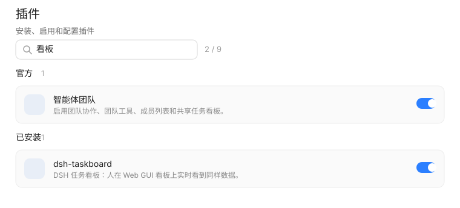

# dsh-plugin-search

给 DSH「插件」页加上一条**关键词搜索框**：装了很多插件时，按名字、描述或包名一筛就找到了。



## 它做什么

在「插件」页（侧栏 **插件**）页头下方注入一条搜索条，边输入边过滤卡片：

- **命中范围**：卡片上看得见的全部文字（标题、描述、「实验性」标签）+ `data-plugin-package` / `data-plugin-item` 里的包名或注册 id。
- **匹配规则**：大小写不敏感的子串匹配；空格分隔的多个关键词之间是 **AND**（输入 `task 看板` 要两个都命中）。
- **整组隐藏**：某个分组一张卡都没命中时，连组标题和计数一起藏掉 —— 不留「官方 0」这种空壳。
- **计数**：搜索条右侧显示 `命中 / 总数`；一张都没命中时显示「没有匹配的插件」。
- **清空**：右侧的 × 或 `Esc` 清空（`Esc` 会被就地消费，不会冒泡去关掉外壳的面板）。
- **跟随语言**：中文界面用中文文案，其余用英文。

## 安装

```bash
dsh plugin --profile web add github:huangxp12/dsh-plugin-search
```

`--profile` 是必需项（省略会报 `required option '--profile <name>' not specified`）；
`web` 是标准 Web profile 的名字，`dsh web` 就是 `dsh --profile web` 的简写。
若你用别的 profile 名（例如自己建的），把它换掉即可。
装完**刷新页面**就生效 —— 前端插件不需要重启。

也可以手动挂到已有 profile 上（例如 `~/.dsh/profiles/desktop`）：

1. 把本包放进 profile 的 `node_modules`（目录联接/junction 即可）：

   ```powershell
   New-Item -ItemType Junction `
     -Path "$env:USERPROFILE\.dsh\profiles\desktop\node_modules\dsh-plugin-search" `
     -Target "<本仓库路径>"
   ```

2. 在 profile 的 `cordis.patch.yml` 末尾追加：

   ```yaml
   - insert:
       - id: plugin-search
         name: 'dsh-plugin-search'
   ```

3. 重载页面（profile 开了 HMR 时，patch 文件本身被监听，通常不必重启）。

回滚：删掉那两行、再删掉 `node_modules\dsh-plugin-search` 这个 junction。

## 它**不**做什么

只读 DOM 上的显示状态，不改数据：

- 不发任何网络请求，不读也不写会话日志；
- 不改 Loader 的启用状态，不装卸插件；
- 不动插件的配置；
- 搜索词为空时，页面的 DOM 与外壳自己渲染的完全一致（所有隐藏标记都会被摘掉）。

宿主半（`lib/index.js`）的 `apply()` 是空的：它存在的唯一意义是让本包在 Loader 树里成为
一个**已启用的条目** —— 客户端 bundle 只对已启用的条目提供服务。

## 实现要点

### 为什么是 DOM 注入，而不是注册一个 slot

「插件」页由 `@deepseek-ai/dsh-client-ui-plugin-manager` 拥有。它对外声明的扩展位只有四个：

| 槽位 | 用途 |
| --- | --- |
| `plugins.item` | **新增**一张官方插件卡片 |
| `plugins.bundle.config` | 某个 bundle 的配置，画在它的详情页 |
| `plugins.row.config` | 某一行（row）的配置 |
| `plugins.detail.{actions,badge,section}` | 某个详情页的头部动作/标签/章节 |

**列表级的工具栏没有槽位。** 而承载该页的 `main` 是 keyed slot，"plugins" 这个 key 已经被
它自己占了 —— 想从槽位走这条路，只能整页顶替它自带的界面，那是 shadowing 外壳 UI：
升级即碎、还要自己重做安装对话框和每个包的配置页。代价和风险都不是「加个搜索框」该付的。

所以这里用与 `dshmarket` 的 `settings-nav-icon` 同一套做法：认准页面自带的稳定 `data-*`
契约，把搜索框挂进去，按关键词切换卡片的显示。

### 依赖的 DOM 契约

| 选择器 | 含义 |
| --- | --- |
| `[data-plugin-panel]` | 页面根；列表态才有 direct child `<header>`，所以详情页自然没有搜索框 |
| `[data-plugin-group="official"\|"bundles"]` | 分组；整组无命中时整组隐藏 |
| `[data-plugin-package="<包名>"]` | 一个已安装/官方 bundle 的卡片 |
| `[data-plugin-item="<id>"]` | 一个官方插件（注册过配置页）的卡片 |

这些属性是外壳自己写在 JSX 上的，是它的对外 DOM 契约，不随构建改变的**哈希类名**漂移：
CSS 模块类名（`fO69Vq_page` 这种）一个都没用。外壳改版时最坏情况是**少一个搜索框**，
而不是把页面搞坏。

### 抗重挂

外壳的列表是 React 渲染的：首屏加载完成、切列表/详情、装卸插件都会重挂卡片甚至整页。
所以：

- 一个 `MutationObserver`（观察 `document.body`，覆盖面版本身被卸载重建）驱动重新同步，
  `queueMicrotask` 合并同一帧内的多次 mutation；
- 搜索词住在 fiber 闭包**外面**的那层 `ctx.effect` 里 —— 卡片被 React 换掉之后过滤自动重算，
  用户输入的那半不会丢；
- 定位会挪动 DOM 节点（打断焦点），所以挪之前存、挪之后恢复焦点与光标位置；
- 样式表每次同步都确认一次存在（`<head>` 被重建时补回来），而不是只在 `apply()` 里插一次。

### 视觉

颜色/圆角全部走外壳的主题 token（`--dsw-alias-*`），明暗主题自动跟随，不写死色值。

搜索条带 **`data-window-drag-recall`**：页头整块是桌面端窗口拖拽区（外壳给 `<header>` 打了
`data-window-drag`，macOS 上整块可拖动），而外壳为「拖拽区里的可交互内容」准备了这个反标记
（`[data-window-drag-recall]{-webkit-app-region:no-drag}`）。用它比在自有样式表里重写一遍更可靠：
即使我们的 `<style>` 还没插进去，外壳的规则也已经生效，不会出现「点搜索框变成拖窗口」。

## 开发

```bash
# 纯逻辑（关键词切分、匹配、文案）+ 加载契约：41 项
node test/unit.test.mjs

# DOM 行为（jsdom，夹具照抄 ui-plugin-manager 真实渲染的层级与属性）：47 项
node test/dom.test.mjs

# 另有可直接用浏览器打开的 test/dom-harness.html（43 项，真实 Chrome 里跑过）
```

两套都**不启动 GUI**：`unit` 用迷你 `__ModuleLoader__` 抓下 bundle 注册的那一行，
`dom` 用 jsdom 搭出与真实页面同构的 DOM 再断言过滤行为。夹具里的层级与 `data-*`
属性就是被测代码赖以定位的契约 —— 夹具改了、`lib/client.js` 没跟上，测试就该红。

还有第四套端到端检查（`tools/verify-live.mjs`，17 项）：向正在运行的 `dsh web` 确认
宿主的启动图里有本包、bundle 取回来与仓库里的文件逐字节一致、`/` 与 `/api` 的鉴权没被
改动。它**刻意不随仓库发布**：为了访问本机 GUI，它要用 `~/.dsh/.credentials.yaml` 里的
`client-connection/browser-session` 密钥签一枚回环会话 cookie，而插件仓库不是存放
「会读取凭据的文件」的地方 —— 无论它多无害，那正是评审该多看一眼的形状。需要时按上面的
说明在本机重建即可；上面三套不需要任何凭据，且覆盖插件自身的行为。

### 文件

- `lib/client.js` — 浏览器半，手写 bundle（`window.__ModuleLoader__.load({id, factory})`），
  **零构建链**：容器里 `require("react")` 之类由外壳的模块表提供，本插件连 react 都不需要。
- `lib/index.js` — 宿主半，`apply()` 为空。
- `test/` — 两套测试 + 一个可直接用浏览器打开的 `dom-harness.html`。
- `docs/preview.svg` — 预览图，由 `tools/render-preview.mjs` 跑真实 `lib/client.js` 生成
  （不是手绘示意图）：输入「看板」后两个分组各留一张命中卡片，搜索条上显示 `2 / 9`。
- `tools/render-preview.mjs` — 重新生成 `docs/preview.svg` 与 `assets/screenshot-1.png`：
  两者都由真实 bundle 驱动着跑一遍，所以截图不会和代码走散。
- `tools/asar-extract.mjs` — 从 `app.asar` 里读外壳源码的只读工具（本次开发用来核对
  `ui-plugin-manager` 的 DOM 契约），与插件运行无关。
